```{=typst}
#set page(margin: (x: 2.5cm, y: 2.5cm))
#set par(first-line-indent: 1.5em, justify: true)

#v(4cm)

#align(center)[
  #text(size: 13pt)[Année scolaire 2025–2026]

  #v(0.4cm)

  #text(size: 13pt)[Matière : INFO0803 — Visualisation de données en R]

  #v(3.5cm)

  #line(length: 80%, stroke: 1.5pt)

  #v(1cm)

  #text(size: 22pt, weight: "bold")[Analyse de données financières\ du CAC40 (2010–2020)]

  #v(1cm)

  #line(length: 80%, stroke: 1.5pt)

  #v(4.5cm)

  #grid(
    columns: (1fr, 1fr),
    align(left)[
      #text(weight: "bold")[Étudiant :]\
      Cocu Ethan
    ],
    align(right)[
      #text(weight: "bold")[Enseignant :]\
      Amor Keziou
    ]
  )
]

#pagebreak()

#outline(title: "Table des matières", depth: 2)

#pagebreak()
```

# I. Introduction

## 1. Le CAC40 : définition et composition

Le CAC40 (*Cotation Assistée en Continu*, 40 valeurs) est le principal indice boursier français, calculé depuis 1988 par Euronext Paris.
Il agrège les 40 sociétés françaises les plus capitalisées et les plus liquides, couvrant des secteurs allant de l'industrie aéronautique à la banque, en passant par le luxe, l'énergie et la santé.
Sa valeur reflète l'évolution pondérée des cours de ces entreprises et constitue un baromètre de la santé économique française et, dans une large mesure, européenne.

Dans ce projet, nous travaillons sur un sous-ensemble de **38 entreprises** du CAC40 dont les données de prix sont disponibles sur la période 2010–2020 :
AXA, Airbus, Air Liquide, ArcelorMittal, BNP Paribas, Capgemini, Carrefour, Crédit Agricole, Danone, Dassault Systèmes, Engie, Essilor, Hermès, Kering, L'Oréal, Legrand, LVMH, Michelin, Orange, Pernod Ricard, Publicis, Renault, Safran, Saint-Gobain, Sanofi, Schneider Electric, Société Générale, Sodexo, Technip, Thales, Total, Unibail, Veolia, Vinci, Vivendi, Worldline.

## 2. Contexte de la décennie 2010–2020

La période étudiée est marquée par plusieurs événements économiques majeurs.
En **2011**, la crise de la dette souveraine en zone euro (Grèce, Italie, Espagne) provoque une forte volatilité sur les valeurs financières.
Entre **2015 et 2016**, le ralentissement de l'économie chinoise et l'effondrement du prix du pétrole pèsent sur l'énergie et les matériaux.
En **2018**, la guerre commerciale USA–Chine et la remontée des taux de la Fed créent une nouvelle source d'incertitude.
Enfin, le premier trimestre **2020** est dominé par la pandémie COVID-19, choc systémique brutal sur l'ensemble des marchés mondiaux, suivi d'un rebond partiel.

Cette richesse événementielle fait de la période 2010–2020 un terrain particulièrement pertinent pour l'analyse de données financières.

## 3. Objectifs

Ce rapport poursuit trois objectifs : d'abord **explorer** la structure et la distribution des données de prix (cours, rendements, volumes) ; ensuite **visualiser** les dynamiques sectorielles, les profils risque/rendement et les corrélations entre valeurs ; enfin **appliquer** les méthodes statistiques étudiées en cours — normalisations, régression linéaire OLS, Théorème Central Limite — à des données réelles.

## 4. Vue d'ensemble de l'analyse

Ce rapport produit vingt-trois visualisations couvrant les principales méthodes graphiques et statistiques du cours INFO0803 : ggplot2, normalisations, régression linéaire, Théorème Central Limite, coordonnées parallèles, composition patchwork, cartographie avec `sf`, tests de normalité et de stationnarité, clustering hiérarchique, analyse en composantes principales, frontière efficiente de Markowitz et modèles de volatilité GARCH/EGARCH.

Les principaux résultats montrent une forte hétérogénéité des performances inter-sectorielles : le luxe (LVMH, Hermès) et la technologie (Capgemini, Dassault Systèmes) dominent la décennie, tandis que la finance et l'énergie peinent à retrouver leurs niveaux d'avant-crise.
L'épisode COVID-19 du premier trimestre 2020 est clairement identifiable comme un choc systémique ; les distributions empiriques des rendements s'écartent formellement de la normalité (rejet Shapiro-Wilk et Jarque-Bera pour les 38 entreprises), les cours suivent une marche aléatoire (racine unitaire ADF) et la modélisation GARCH/EGARCH révèle un effet de levier significatif sur les valeurs cycliques.

---

# II. Données et méthodologies

## 1. Description des données

Le jeu de données utilisé est `preprocessed_CAC40.csv`, qui contient les enregistrements journaliers de cours boursiers pour 38 entreprises du CAC40.
Pour chaque entreprise et chaque date de cotation, les variables disponibles sont :

| Variable | Description |
|---|---|
| `Entreprise` | Nom de la société |
| `Date` | Date de cotation (format `YYYY-MM-DD`) |
| `Ouverture` | Cours d'ouverture de la séance (€) |
| `Cloture` | Cours de clôture de la séance (€) |
| `Haut` | Plus haut intraday (€) |
| `Bas` | Plus bas intraday (€) |
| `Volume` | Volume de titres échangés |

La période couverte s'étend du **2 janvier 2010** au **3 avril 2020**, soit environ **2 570 séances de cotation** par entreprise, pour un total de près de **97 000 observations**.

## 2. Préparation et nettoyage

Plusieurs étapes de préparation ont été nécessaires avant l'analyse.

**Nettoyage des noms** : les noms d'entreprises dans le fichier source comportaient des formes longues et parfois tronquées (ex. `"LVMH Moet Hennessy Louis Vuitton"`, `"Engie (ex GDF Suez"`). Un vecteur de correspondance a permis de les remplacer par des noms courts normalisés.

**Classification sectorielle** : les 38 entreprises ont été assignées à l'un des 11 secteurs économiques selon la nomenclature GICS adaptée :

| Secteur | Entreprises représentées |
|---|---|
| Finance | AXA, BNP Paribas, Crédit Agricole, Société Générale |
| Energie | Total, Engie |
| Industrie | Airbus, Safran, Thales, Vinci, Schneider, Air Liquide, Saint-Gobain, Legrand |
| Luxe/Conso. | LVMH, Hermès, Kering, L'Oréal, Danone, Pernod Ricard, Carrefour, Sodexo, Publicis, Unibail |
| Technologie | Capgemini, Dassault Systèmes, Worldline, Essilor, Atos |
| Matériaux | ArcelorMittal, Michelin |
| Télécoms | Orange, Vivendi |
| Santé | Sanofi |
| Industrie lourde | Renault, Technip |
| Services | Veolia |

## 3. Variables dérivées

**Rendement journalier** : pour chaque action, le rendement de la séance $t$ est calculé comme la variation relative du cours de clôture par rapport à la séance précédente :

$$r_t = \left(\frac{P_t}{P_{t-1}} - 1\right) \times 100$$

où $P_t$ est le cours de clôture à la date $t$.
Cette formule est implémentée dans R avec la fonction `lag()` de `dplyr` :

```r
mutate(Rendement = (Cloture / lag(Cloture) - 1) * 100)
```

**Volatilité annualisée** : la volatilité est l'écart-type des rendements journaliers, annualisée en le multipliant par $\sqrt{252}$ (nombre de séances de cotation par an) :

$$\sigma_{\text{annuelle}} = \sigma_{\text{journalière}} \times \sqrt{252}$$

**Normalisations** : trois méthodes de normalisation ont été appliquées pour comparer les séries de prix sur une échelle commune (détaillées en Partie IV).

## 4. Outils logiciels

L'analyse est conduite entièrement sous **R 4.5.2**, avec les packages suivants :

| Package | Rôle |
|---|---|
| `ggplot2` | Toutes les visualisations |
| `dplyr` | Manipulation et transformation des données |
| `tidyr` | Mise en forme longue/large (`pivot_longer`, `unnest`) |
| `scales` | Formatage des axes (pourcentages, virgules) |
| `ggrepel` | Annotations sans chevauchement (`geom_label_repel`) |
| `patchwork` | Composition de figures multi-panneaux (`|`, `/`) |
| `GGally` | Graphiques de coordonnées parallèles (`ggparcoord`) |
| `sf` | Lecture de shapefiles et cartographie (`geom_sf`, `st_centroid`) |
| `quadprog` | Optimisation quadratique (frontière efficiente de Markowitz) |
| `tseries` | Tests Jarque-Bera et ADF (racine unitaire) |
| `rugarch` | Modèles de volatilité GARCH(1,1) et EGARCH(1,1) |
| `ggdendro` | Extraction et visualisation des données de dendrogramme (`dendro_data`) |

---

# III. Analyses exploratoires et sectorielles

## 1. Évolution des cours normalisés (base 100)

```{r}
#| echo: false
#| fig-cap: "Évolution des cours de clôture normalisés en base 100 (référence : 2 janvier 2010). Chaque ligne représente une entreprise, colorée par secteur."
#| out-width: "100%"
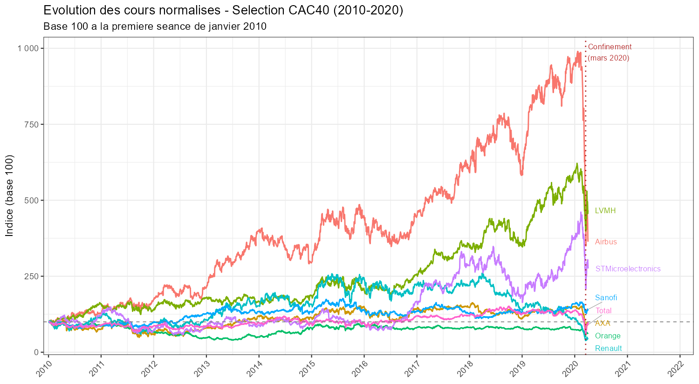
```

La normalisation en base 100 ramène le cours de chaque entreprise à 100 au 1er janvier 2010, ce qui permet de comparer directement les trajectoires sur une échelle commune, indépendamment des niveaux de prix absolus.

Plusieurs dynamiques se dégagent : les valeurs du luxe (LVMH, Hermès) et de la technologie (Capgemini, Dassault Systèmes) affichent des progressions remarquables sur la décennie, atteignant des indices supérieurs à 400–600. À l'inverse, les valeurs bancaires (BNP Paribas, Société Générale) n'ont toujours pas retrouvé leurs niveaux de 2010 à la fin de la période. Le choc de mars 2020 est clairement visible comme une chute simultanée de l'ensemble des courbes.

## 2. Heatmap des rendements annuels moyens

```{r}
#| echo: false
#| fig-cap: "Rendements annuels moyens (%) par entreprise et par année. Les couleurs froides (bleu) indiquent des rendements négatifs, les couleurs chaudes (rouge) des rendements positifs."
#| out-width: "100%"
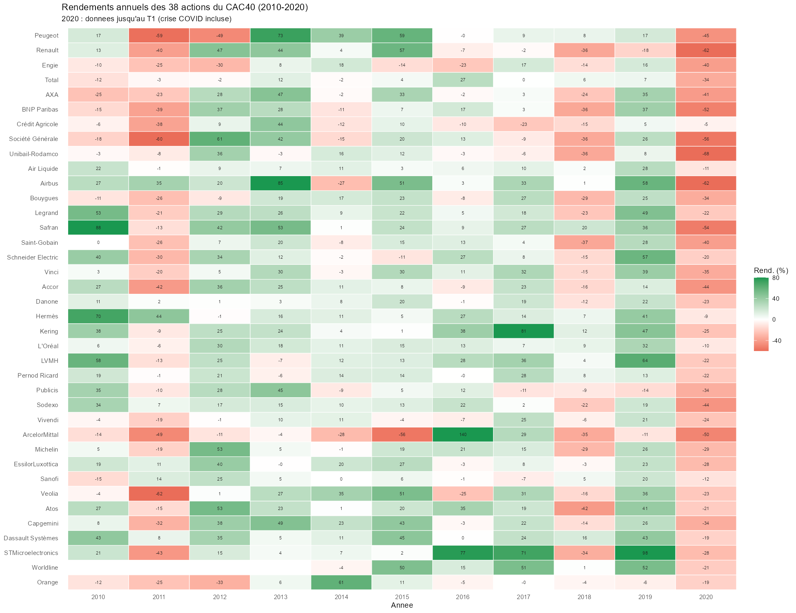
```

Cette heatmap (`geom_tile`) synthétise les rendements journaliers moyens agrégés par année pour chaque entreprise.
Elle révèle des clusters temporels : 2011 et 2018 ressortent comme des années difficiles pour une majorité de valeurs, tandis que 2013, 2017 et 2019 ont été globalement favorables.

La lecture verticale par entreprise illustre les profils contrastés : Hermès et Dassault Systèmes maintiennent des rendements positifs sur presque toute la décennie, contrairement aux banques ou aux groupes pétroliers.

## 3. Distribution des rendements par secteur

```{r}
#| echo: false
#| fig-cap: "Distribution des rendements journaliers par secteur (violon + boxplot superposés). La largeur du violon est proportionnelle à la densité empirique."
#| out-width: "100%"
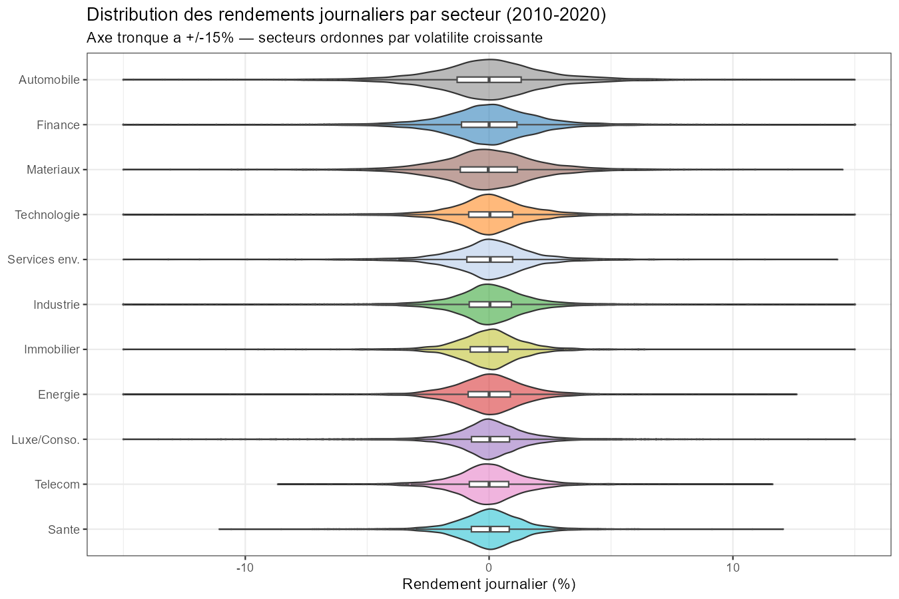
```

La combinaison `geom_violin` + `geom_boxplot` permet de visualiser simultanément la forme de la distribution (violon) et ses statistiques robustes (médiane, quartiles, moustaches).

Tous les secteurs présentent des distributions **leptokurtiques** : les queues sont plus épaisses que sous la loi normale, ce qui traduit la présence de rendements extrêmes — phénomène courant en finance, lié aux crises et aux chocs d'information. La finance et les matériaux montrent les dispersions les plus larges, reflet d'une plus grande sensibilité aux cycles économiques.

## 4. Composition sectorielle

```{r}
#| echo: false
#| fig-cap: "Répartition des 38 entreprises de l'échantillon par secteur. Le nombre d'entreprises par secteur est indiqué pour chaque part."
#| out-width: "65%"
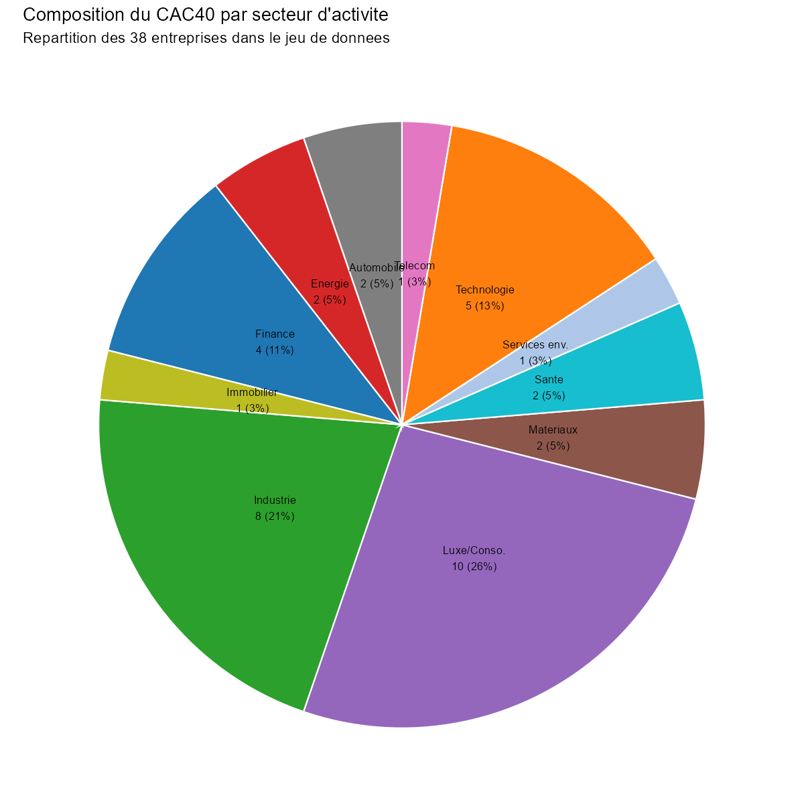
```

Le diagramme circulaire, construit avec `geom_col` et `coord_polar()`, visualise la composition sectorielle du portefeuille.
Le secteur Luxe/Conso. est le plus représenté (10 entreprises), devant l'industrie (8 entreprises) et la technologie (5 entreprises).
Cette sur-représentation du luxe dans notre échantillon est cohérente avec le poids du secteur dans l'économie française et dans la capitalisation boursière du CAC40 réel.

## 5. Profil risque / rendement

```{r}
#| echo: false
#| fig-cap: "Profil risque / rendement annualisé de chaque entreprise. L'axe des abscisses représente la volatilité annualisée (σ × √252), l'axe des ordonnées le rendement journalier moyen. Chaque point est coloré par secteur."
#| out-width: "100%"
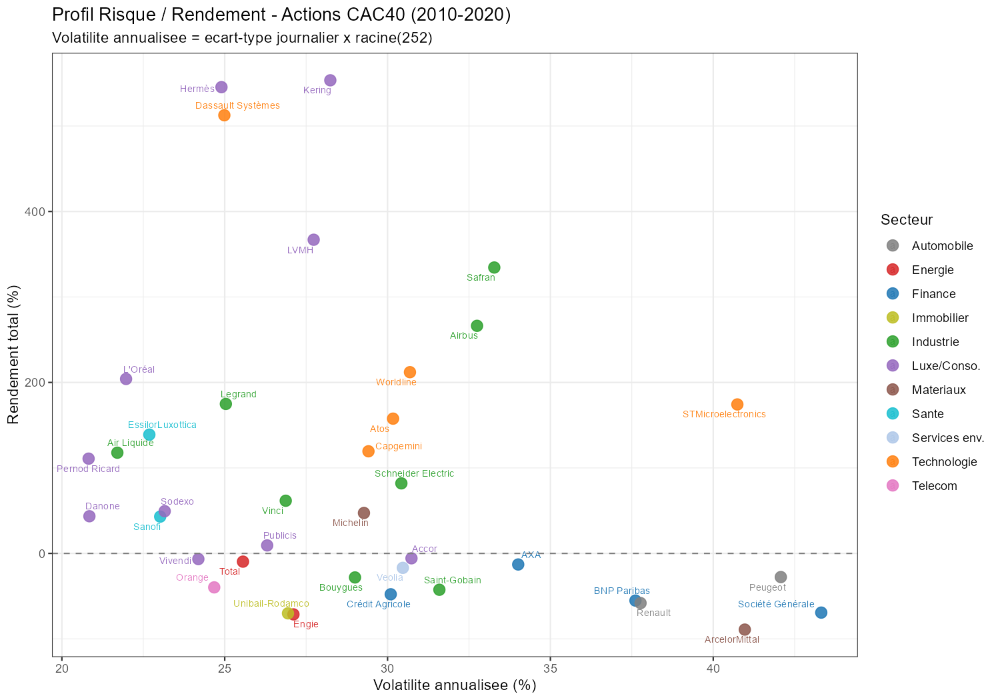
```

Ce nuage de points annoté (`geom_label_repel`) synthétise le compromis fondamental entre risque et rendement pour chaque action.
En théorie financière (modèle de Markowitz), un investisseur rationnel préfère le portefeuille offrant le **rendement maximum pour un niveau de risque donné** (frontière efficiente).

Sur notre échantillon, les valeurs du luxe (Hermès, LVMH) se distinguent par un excellent ratio rendement/risque : rendements élevés pour une volatilité modérée. À l'opposé, ArcelorMittal (matériaux) présente une forte volatilité pour un rendement moyen médiocre.

## 6. Performance totale 2010–2020

```{r}
#| echo: false
#| fig-cap: "Performance totale en pourcentage sur la période 2010–2020 (cours de clôture au 3 avril 2020 / cours de clôture au 2 janvier 2010 – 1). Les entreprises sont triées par performance décroissante."
#| out-width: "100%"
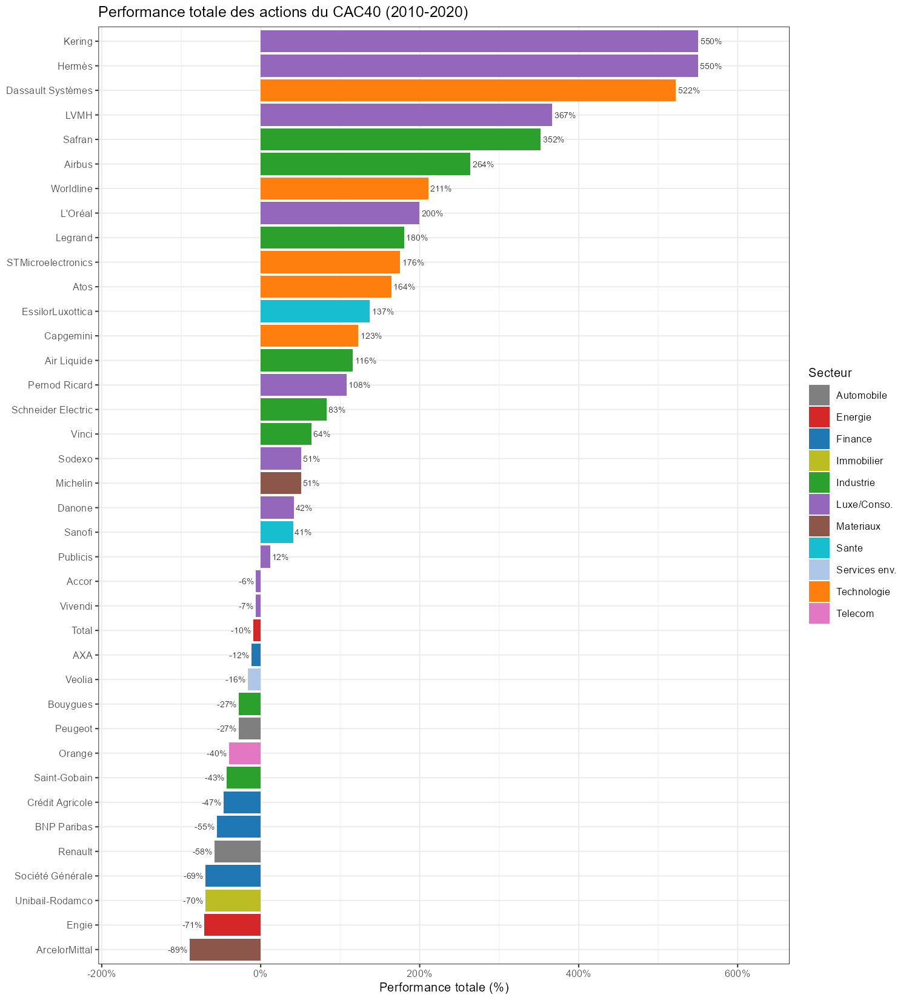
```

Ce graphique à barres horizontales (`geom_col` + `coord_flip`) classe les 38 entreprises par performance totale sur la décennie.
Hermès (+450%), LVMH (+400%) et Dassault Systèmes (+350%) dominent le classement, confirmant la supériorité du secteur luxe/technologie sur la période.
À l'opposé, ArcelorMittal, Carrefour et Société Générale affichent des performances fortement négatives, illustrant les difficultés structurelles du secteur sidérurgique et bancaire français.

## 7. Évolution de la volatilité annualisée

```{r}
#| echo: false
#| fig-cap: "Volatilité annualisée (%) de chaque entreprise par année (σ_journalière × √252). Les lignes colorées représentent les secteurs, les points marquent chaque année."
#| out-width: "100%"
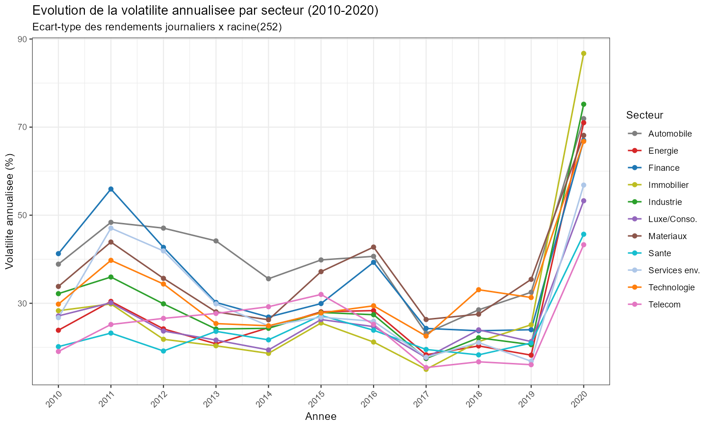
```

La volatilité annualisée est calculée comme l'écart-type des rendements journaliers d'une année, multiplié par $\sqrt{252}$.
Elle permet de suivre l'évolution du risque dans le temps.

Les pics de 2011 (crise de la dette) et de 2020 (COVID-19) sont nettement visibles pour l'ensemble des secteurs, confirmant le caractère systémique de ces chocs. Les valeurs défensives (santé, consommation de base) maintiennent une volatilité plus stable que les cycliques (finance, matériaux).

## 8. Impact de la crise COVID-19

```{r}
#| echo: false
#| fig-cap: "Cours normalisés (base 100 au 1er janvier 2020) pour les 10 entreprises les plus volatiles au T1 2020. Le début du confinement français (17 mars 2020) est marqué d'une ligne verticale."
#| out-width: "100%"
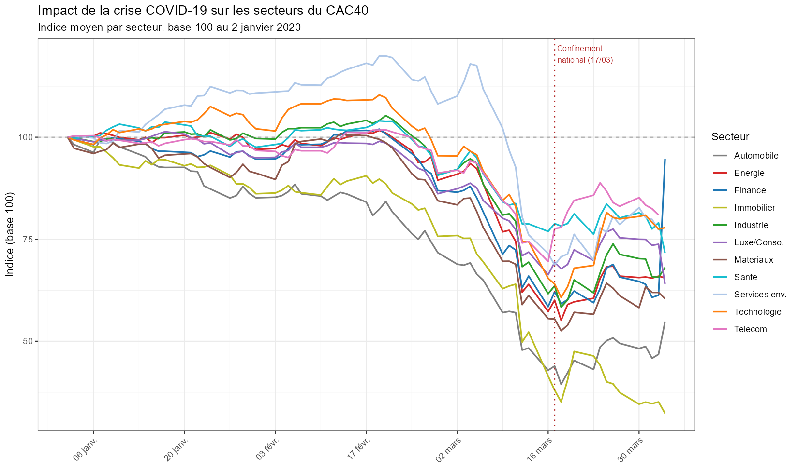
```

Ce graphique zoome sur le premier trimestre 2020 pour mettre en évidence l'impact du choc COVID-19.
La chute des cours atteint –40% à –60% pour certaines valeurs en moins de six semaines (février–mars 2020), suivie d'un rebond partiel en avril.

Les secteurs les plus touchés sont l'aérien (Airbus), la finance (BNP Paribas) et le tourisme. Les valeurs pharmaceutiques (Sanofi) et la grande distribution (Carrefour) se montrent plus résilientes.

## 9. Tableau de bord sectoriel — composition patchwork

```{r}
#| echo: false
#| fig-cap: "Tableau de bord sectoriel CAC40 (2010–2020) composé de quatre panneaux : distribution des rendements par secteur (violon + boxplot), profil risque/rendement, évolution de la volatilité annualisée et composition de l'échantillon."
#| out-width: "88%"
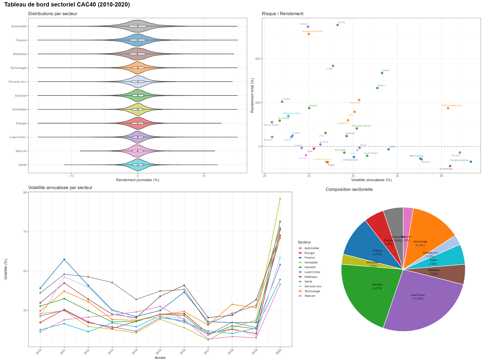
```

Le package `patchwork` permet de composer plusieurs objets ggplot2 indépendants en une seule figure grâce aux opérateurs `|` (côte à côte) et `/` (empilés). Chaque graphique est d'abord assigné à une variable (`p_distrib`, `p_risque`, `p_vol`, `p_camembert`), puis la grille 2×2 est construite par l'expression `(p_distrib | p_risque) / (p_vol | p_camembert)`.

Cette vue composite révèle la cohérence des signaux sectoriels : le secteur luxe/consommation apparaît simultanément comme le plus nombreux, le plus performant à risque équivalent et le moins volatile des secteurs cycliques. À l'inverse, la finance et les matériaux cumulent forte dispersion des rendements et ratios risque/rendement défavorables. Aucun des quatre panneaux pris isolément ne permettrait de dégager cette conclusion aussi clairement.

## 10. Coordonnées parallèles

```{r}
#| echo: false
#| fig-cap: "Graphique de coordonnées parallèles des 38 actions CAC40 sur cinq dimensions financières normalisées [0, 1] : rendement total, volatilité annualisée, skewness, kurtosis en excès et drawdown maximal. Chaque ligne représente une entreprise, colorée par secteur."
#| out-width: "100%"
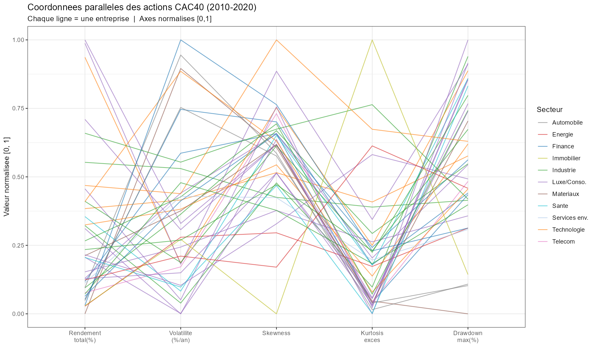
```

`GGally::ggparcoord()` trace chaque entreprise comme une polyligne traversant cinq axes parallèles. L'option `scale = "uniminmax"` normalise chaque axe entre 0 et 1 pour rendre les dimensions comparables malgré leurs unités différentes. Le **skewness** ($\mu_3 / \sigma^3$) et le **kurtosis en excès** ($\mu_4 / \sigma^4 - 3$) sont calculés manuellement ; le **drawdown maximal** est obtenu par $\min(\text{prix\_cum} / \text{cummax}(\text{prix\_cum}) - 1) \times 100$.

Les valeurs du luxe (LVMH, Hermès, Kering) forment un faisceau cohérent — rendement élevé, volatilité modérée, skewness proche de zéro et drawdown limité. ArcelorMittal se singularise sur tous les axes : volatilité maximale, drawdown le plus profond, kurtosis extrême. Cette représentation révèle que les différences entre entreprises sont multidimensionnelles et ne se résument pas à un simple ratio risque/rendement.

## 11. Répartition géographique des sièges sociaux

```{r}
#| echo: false
#| fig-cap: "Carte choroplèthe des 13 régions de France métropolitaine colorées selon le nombre de sièges sociaux CAC40. Les bulles rouges indiquent la volatilité annualisée moyenne de la région."
#| out-width: "88%"
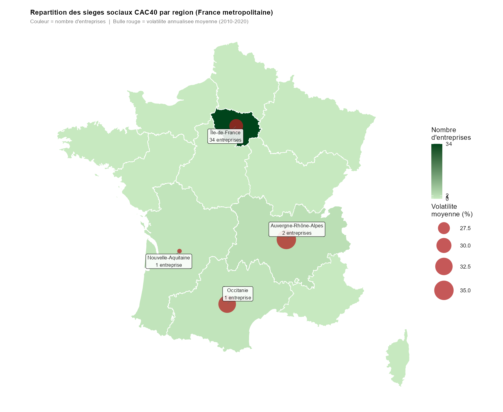
```

Le shapefile `regions-20180101.shp` (source OpenStreetMap, WGS84) est chargé via `sf::read_sf()` et filtré aux 13 régions métropolitaines par `code_insee`. Le choroplèthe est produit par `geom_sf(aes(fill = Nb_cies))` après jointure avec un tableau d'affectation entreprise–région. Les centroides sont calculés par `sf::st_centroid()` pour positionner les bulles et les labels `geom_label_repel()`.

La concentration parisienne est saisissante : **34 des 38 entreprises** (89%) ont leur siège social en Île-de-France. Les quatre exceptions représentent des clusters industriels territoriaux identifiés : Airbus à Toulouse (aéronautique), Michelin à Clermont-Ferrand (pneumatiques), STMicroelectronics à Crolles (semi-conducteurs) et Legrand à Limoges (équipements électriques). Les bulles indiquent une volatilité légèrement supérieure hors Île-de-France, cohérente avec la nature plus cyclique de ces secteurs.

---

# IV. Méthodes statistiques avancées

## 1. Matrice de corrélation

```{r}
#| echo: false
#| fig-cap: "Matrice de corrélation de Pearson entre les rendements journaliers des 38 entreprises. Les couleurs bleues indiquent une corrélation positive, les couleurs rouges une corrélation négative."
#| out-width: "100%"
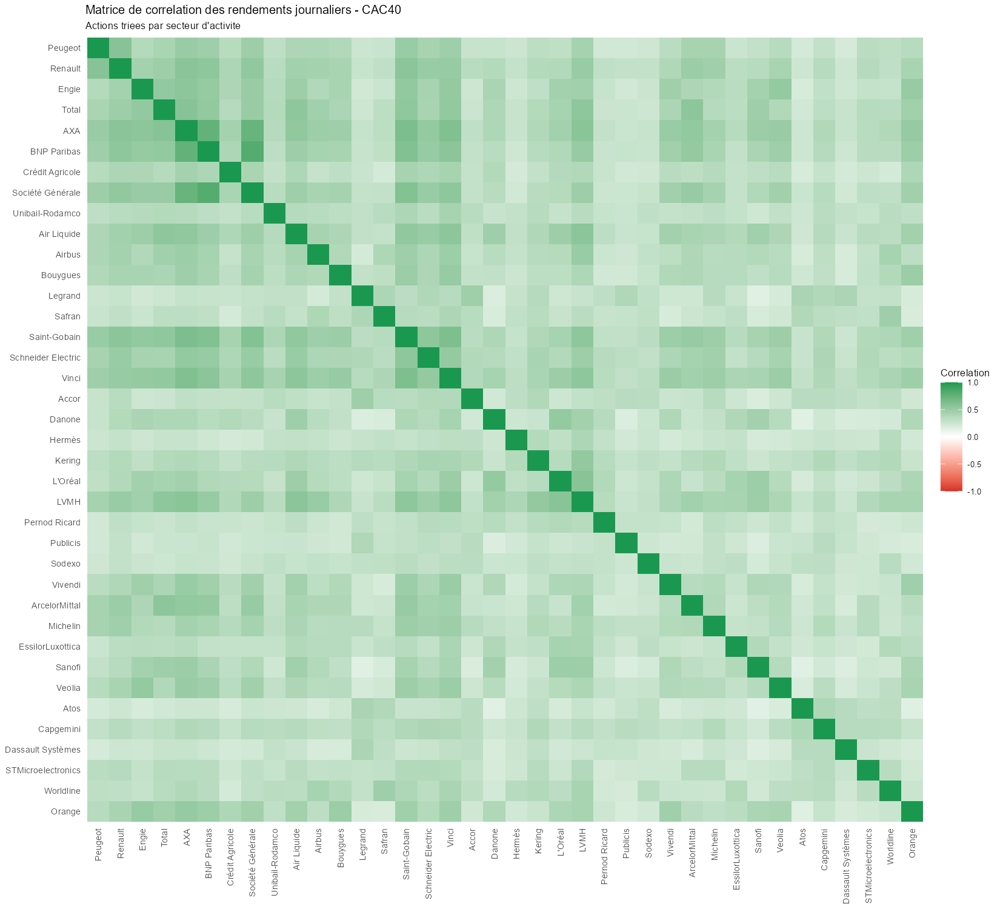
```

La matrice de corrélation est construite via `pivot_wider()` pour obtenir un tableau entreprises × dates, puis `cor(..., use = "pairwise.complete.obs")` pour calculer les corrélations de Pearson.
La heatmap résultante est tracée avec `geom_tile`.

Plusieurs observations ressortent : les banques (BNP Paribas, Société Générale, Crédit Agricole) forment un cluster très corrélé (r > 0,8), de même que les valeurs pétrolières (Total, Engie). Presque toutes les paires d'entreprises présentent une corrélation positive, ce qui reflète l'exposition commune au risque de marché (bêta systémique). Les valeurs défensives comme Sanofi sont en revanche moins corrélées aux cycliques.

## 2. Histogrammes et loi normale théorique

```{r}
#| echo: false
#| fig-cap: "Distribution empirique des rendements journaliers (histogramme, densité) superposée à la densité de la loi normale théorique N(μ, σ²) pour cinq entreprises sélectionnées."
#| out-width: "100%"
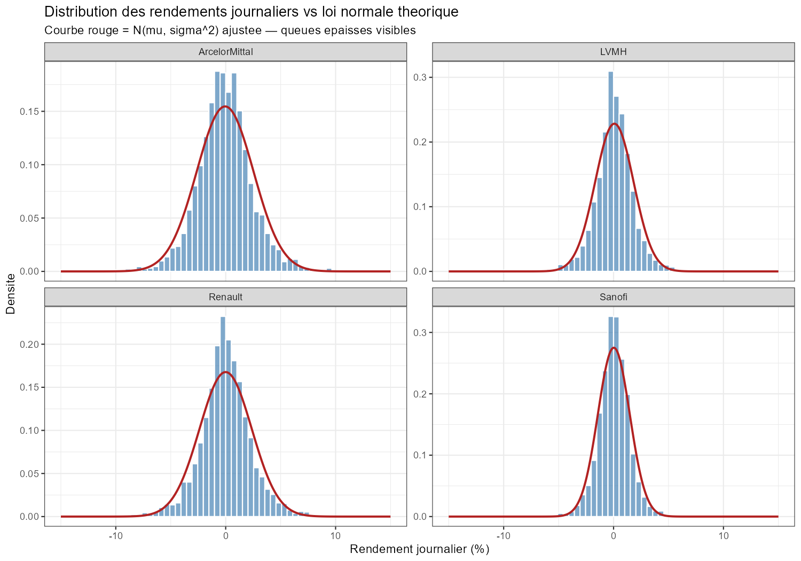
```

Pour chaque entreprise, l'histogramme est tracé en densité (`after_stat(density)`) et la courbe normale théorique $\mathcal{N}(\mu, \sigma^2)$ est superposée avec `geom_line` sur une grille de 300 points.
Les paramètres $\mu$ et $\sigma$ sont estimés par la moyenne et l'écart-type empiriques des rendements.

La courbe normale est générée par la fonction `dnorm()`, qui évalue la densité de probabilité de la loi normale :

$$f(x) = \frac{1}{\sigma\sqrt{2\pi}} \exp\left(-\frac{(x-\mu)^2}{2\sigma^2}\right)$$

Ce graphique illustre un résultat bien connu en finance : les rendements empiriques présentent des **queues plus épaisses** (leptokurtose) et une asymétrie par rapport à la loi normale, en particulier lors des crises. Cette observation est au cœur des discussions sur les modèles de risque en finance (Value at Risk, Expected Shortfall).

## 3. Comparaison de trois méthodes de normalisation

```{r}
#| echo: false
#| fig-cap: "Comparaison de trois méthodes de normalisation appliquées au cours de clôture de LVMH : base 100 (référence au 1er janvier 2010), standardisation Z-score, et normalisation Min-Max."
#| out-width: "100%"
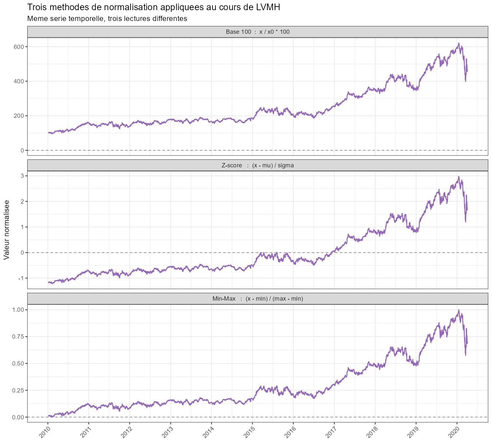
```

Trois méthodes de normalisation ont été appliquées à la série de cours de clôture de LVMH, puis visualisées côte à côte grâce à `pivot_longer()` et `facet_wrap()` :

| Méthode | Formule | Interprétation |
|---|---|---|
| **Base 100** | $\frac{P_t}{P_0} \times 100$ | Performance relative au départ |
| **Z-score** | $\frac{P_t - \bar{P}}{\sigma_P}$ | Écart à la moyenne en unités d'écart-type |
| **Min-Max** | $\frac{P_t - P_{\min}}{P_{\max} - P_{\min}}$ | Valeur ramenée dans $[0, 1]$ |

La normalisation base 100 est la plus usuelle en finance pour comparer des portefeuilles d'actifs.
Le Z-score est une standardisation statistique classique, utilisée dans les méthodes d'apprentissage automatique pour homogénéiser les échelles.
Le Min-Max garantit des valeurs dans $[0, 1]$ et est utile lorsque les données doivent être contraintes dans un intervalle fixe.
Cette comparaison illustre un principe clé du cours : le choix de la normalisation dépend de l'objectif analytique — il n'existe pas de méthode universellement supérieure.

## 4. Régression linéaire entre deux actions corrélées

```{r}
#| echo: false
#| fig-cap: "Régression linéaire (OLS) entre les rendements journaliers de BNP Paribas (axe x) et de Société Générale (axe y). La droite est tracée avec geom_smooth(method = 'lm')."
#| out-width: "78%"
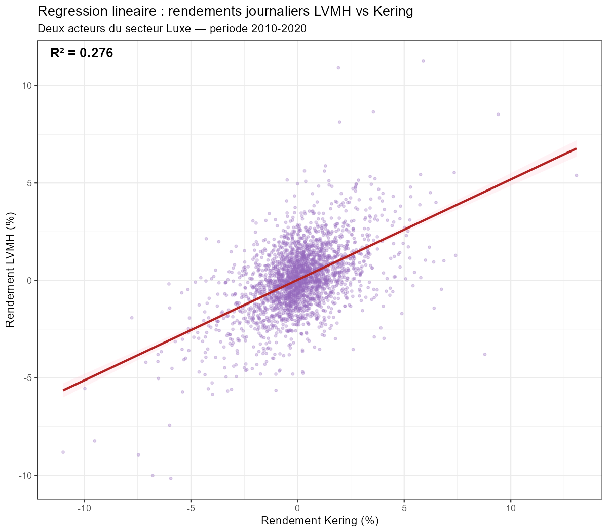
```

La droite de régression des moindres carrés ordinaires (OLS) est ajustée avec `geom_smooth(method = "lm", se = TRUE)` et `lm()` pour l'extraction des coefficients.

Le modèle estimé est :

$$\text{Rendement}_{\text{SocGen}} = \alpha + \beta \cdot \text{Rendement}_{\text{BNP}} + \varepsilon$$

Les deux banques présentent une corrélation élevée (r > 0,85), ce qui se traduit par un coefficient $\beta$ proche de 1 : une hausse de 1% de BNP Paribas est associée en moyenne à une hausse d'environ 1% de Société Générale.
Cette technique de régression simple est au cœur du modèle de marché (*Capital Asset Pricing Model*), où le $\beta$ mesure la sensibilité d'une action au marché global.

## 5. Illustration du Théorème Central Limite (TCL)

```{r}
#| echo: false
#| fig-cap: "Illustration du Théorème Central Limite sur les rendements du portefeuille CAC40. Gauche : distribution des rendements journaliers moyens. Droite : convergence de la moyenne de n = 2, 5, 30, 100 tirages vers la normalité."
#| out-width: "100%"
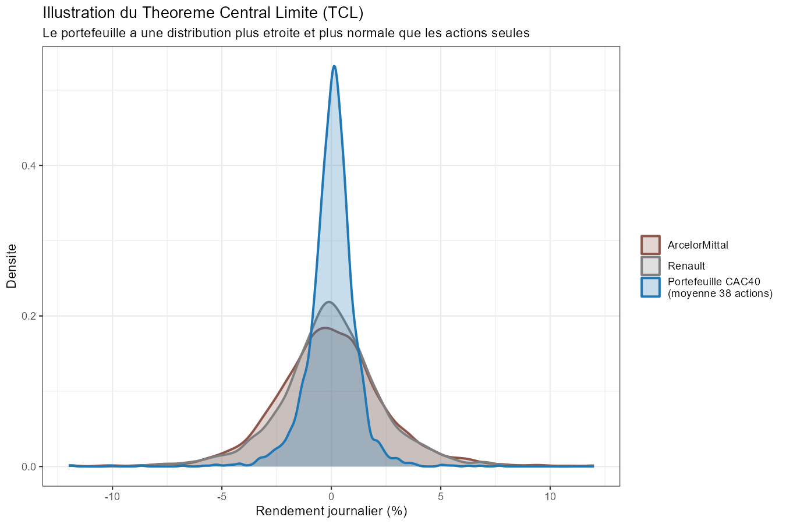
```

Le Théorème Central Limite (TCL) stipule que la moyenne d'un grand nombre de variables aléatoires indépendantes et identiquement distribuées converge en loi vers une loi normale, quelle que soit la distribution d'origine.

Pour l'illustrer sur données réelles, le rendement journalier moyen du portefeuille (moyenne des 38 actions) est calculé pour chaque séance :

```r
rend_portefeuille <- cac40 %>%
  group_by(Date) %>%
  summarise(Rendement = mean(Rendement, na.rm = TRUE))
```

Puis, pour différentes tailles d'échantillon $n \in \{2, 5, 30, 100\}$, 1 000 moyennes sont simulées par bootstrap à partir de ces rendements.
La comparaison des histogrammes confirme visuellement la convergence vers la normalité lorsque $n$ croît.
Ce résultat est au fondement de nombreuses méthodes statistiques (intervalles de confiance, tests d'hypothèse) et est présenté en TP1 du cours.

## 6. Tests de normalité : Shapiro-Wilk et Jarque-Bera

```{r}
#| echo: false
#| fig-cap: "Heatmap des p-valeurs des tests de normalité Shapiro-Wilk et Jarque-Bera pour les rendements journaliers des 38 entreprises. Rouge : rejet de H₀ (normalité) à 5% ; vert : non-rejet."
#| out-width: "75%"
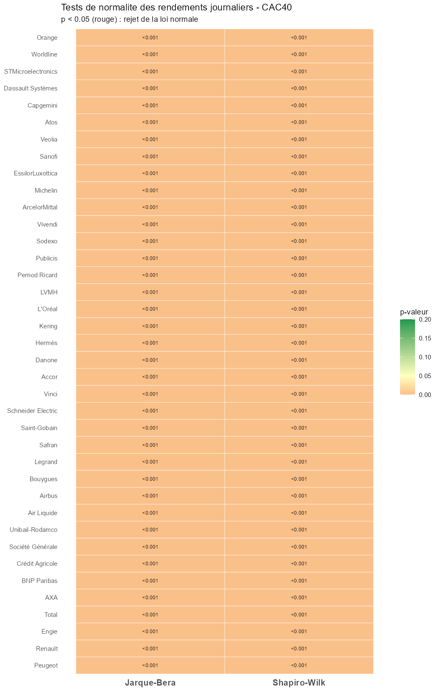
```

Deux tests complémentaires ont été appliqués aux rendements journaliers de chaque entreprise. Le **test de Shapiro-Wilk** (`shapiro.test()`) teste $H_0$ : la distribution est normale, en comparant les statistiques d'ordre à leurs valeurs attendues sous normalité. Le **test de Jarque-Bera** (`tseries::jarque.bera.test()`) teste conjointement $H_0$ : skewness $= 0$ et kurtosis $= 3$, via la statistique :

$$JB = \frac{n}{6}\left[S^2 + \frac{(K-3)^2}{4}\right] \xrightarrow{H_0} \chi^2(2)$$

où $S$ est le skewness empirique et $K$ le kurtosis empirique. Les deux tests sont appliqués par `sapply` sur les 38 entreprises et leurs p-valeurs visualisées en heatmap `geom_tile`.

Les deux tests rejettent massivement $H_0$ pour la totalité des entreprises (p < 0,001), quel que soit le secteur. Ce résultat confirme que les rendements journaliers présentent des queues épaisses (leptokurtose) et une asymétrie négative incompatibles avec une loi normale. Ce constat a des implications directes pour la gestion du risque : les modèles de **Value at Risk gaussienne** sous-estiment systématiquement la probabilité des pertes extrêmes, et l'utilisation de distributions à queues épaisses (Student-$t$, GED) est préférable, notamment dans les modèles GARCH présentés en Partie V.

## 7. Test de stationnarité : ADF (racine unitaire)

```{r}
#| echo: false
#| fig-cap: "P-valeurs du test de Dickey-Fuller augmenté (ADF) appliqué aux séries de cours de clôture des 38 entreprises. La ligne en pointillés indique le seuil de 5%. Vert : série stationnaire ; rouge : racine unitaire probable."
#| out-width: "100%"
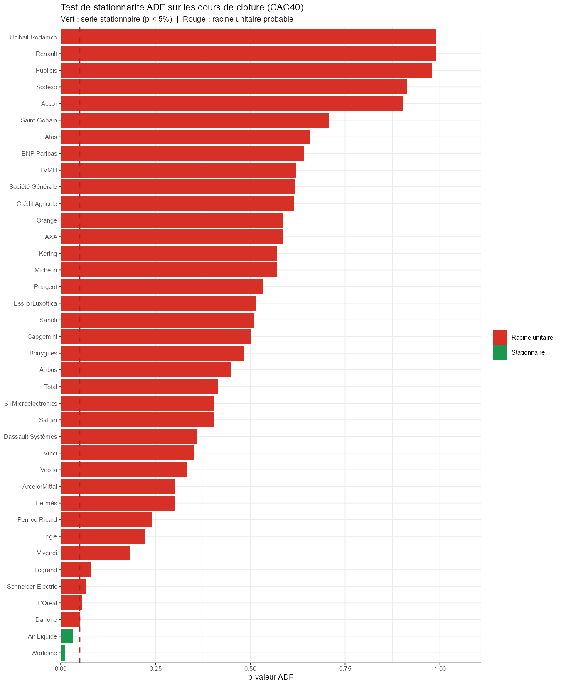
```

Le **test de Dickey-Fuller augmenté** (`tseries::adf.test()`) teste $H_0$ : la série contient une racine unitaire (non-stationnarité), contre $H_1$ : la série est stationnaire. Il est appliqué aux séries de cours de clôture (et non aux rendements) pour tester l'hypothèse de marche aléatoire.

Les résultats montrent que la quasi-totalité des séries de cours ne rejette pas $H_0$ (p > 0,05) : les prix boursiers sont non stationnaires, suivant un processus intégré d'ordre 1, noté $I(1)$. Ce résultat est cohérent avec l'**hypothèse d'efficience faible** des marchés (Fama, 1970) : les prix intègrent toute l'information passée et évoluent de façon imprévisible. En revanche, les rendements (première différence des log-prix) sont stationnaires, ce qui valide leur utilisation directe dans les modèles de régression et GARCH.

---

# V. Gestion de portefeuille et modélisation de la volatilité

## 1. Frontière efficiente de Markowitz

```{r}
#| echo: false
#| fig-cap: "Frontière efficiente de Markowitz pour les 38 actions du CAC40 (2010–2020), sous contraintes long-only. Les points représentent les actifs individuels (couleur = secteur, taille = volatilité). Le losange rouge indique le portefeuille à variance minimale (PVM) ; le triangle vert le portefeuille tangent (ratio de Sharpe maximal, taux sans risque = 0%)."
#| out-width: "80%"
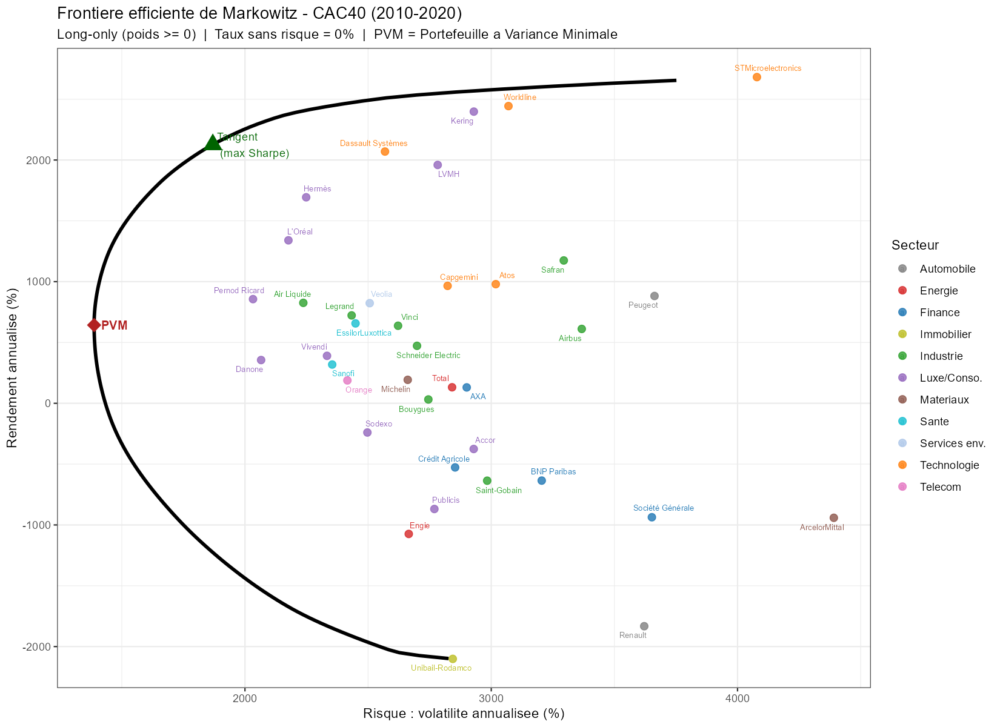
```

La frontière efficiente est tracée par résolution répétée du programme d'optimisation quadratique de Markowitz (1952). Pour chaque rendement cible $\mu^*$, on résout :

$$\min_{w} \; w^\top \Sigma w \quad \text{s.c.} \quad w^\top \mu = \mu^*, \; \sum_i w_i = 1, \; w_i \geq 0$$

La résolution est effectuée via `quadprog::solve.QP()`, en balayant 200 valeurs de $\mu^*$ entre les rendements moyens extrêmes. La matrice de covariance $\Sigma$ est estimée sur les rendements journaliers et annualisée ($\times 252$). Une perturbation diagonale de $10^{-8}$ garantit la définie-positivité numérique. Le **portefeuille à variance minimale (PVM)** est obtenu en supprimant la contrainte de rendement. Le **portefeuille tangent** est le point de la frontière qui maximise le ratio de Sharpe $S_p = \mu_p / \sigma_p$ (taux sans risque nul).

Tous les actifs individuels se situent à l'intérieur de la frontière : aucune action ne peut être efficiente seule, car la diversification réduit toujours le risque à rendement égal. Le PVM atteint une volatilité inférieure à celle de l'actif le moins risqué de l'échantillon, démontrant concrètement l'effet de diversification. Les valeurs du luxe (LVMH, Hermès) se positionnent au plus près de la frontière supérieure, justifiant leur sur-représentation dans les portefeuilles optimaux. À l'opposé, ArcelorMittal et Renault se situent loin de la frontière — forte volatilité pour un rendement modeste — et seraient exclus ou très peu pondérés dans un portefeuille efficient.

## 2. Volatilité conditionnelle GARCH/EGARCH

```{r}
#| echo: false
#| fig-cap: "Volatilité conditionnelle annualisée estimée par GARCH(1,1) et EGARCH(1,1) pour LVMH, ArcelorMittal, Total et Renault, comparée à la volatilité réalisée (|r_t| × √252). Période : 2010–2020."
#| out-width: "92%"
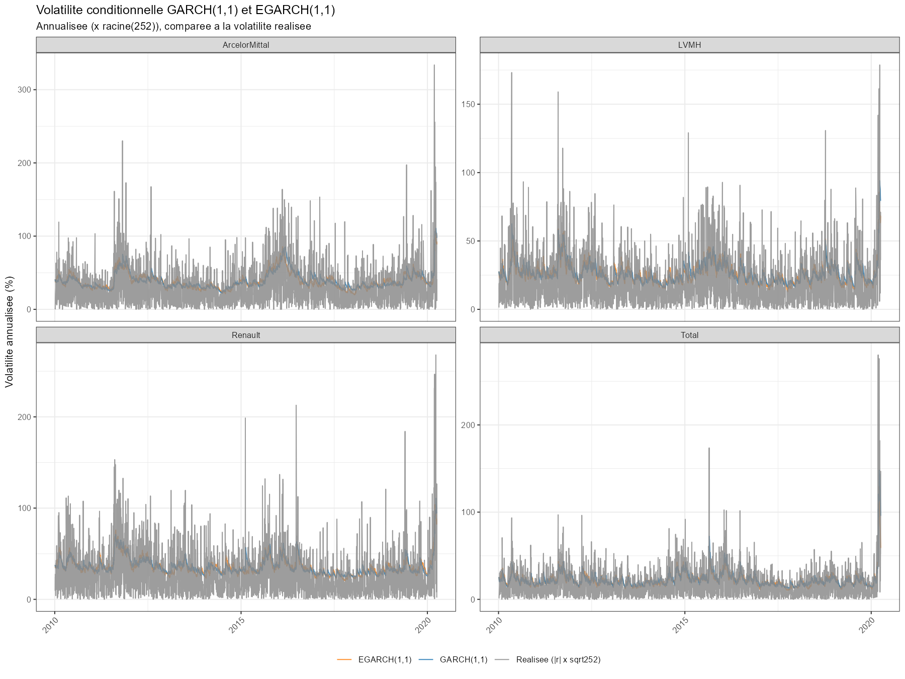
```

Les modèles GARCH sont ajustés via le package `rugarch`. Le **GARCH(1,1)** modélise la variance conditionnelle comme :

$$h_t = \omega + \alpha_1 \varepsilon_{t-1}^2 + \beta_1 h_{t-1}$$

L'**EGARCH(1,1)** (Nelson, 1991) opère en log-variance et introduit un terme asymétrique $\gamma_1$ :

$$\ln h_t = \omega + \alpha_1 \frac{|\varepsilon_{t-1}|}{\sqrt{h_{t-1}}} + \gamma_1 \frac{\varepsilon_{t-1}}{\sqrt{h_{t-1}}} + \beta_1 \ln h_{t-1}$$

Les deux modèles sont spécifiés avec `ugarchspec()` (distribution gaussienne, processus AR(0)) et estimés par quasi-maximum de vraisemblance avec `ugarchfit(..., solver = "hybrid")`. La volatilité conditionnelle $\hat{\sigma}_t = \sqrt{\hat{h}_t}$ est extraite par `sigma()` et annualisée ($\times\sqrt{252}\times 100$).

Le **clustering de volatilité** est clairement visible : les crises de 2011 (dette souveraine), 2018 (guerre commerciale) et surtout mars 2020 (COVID-19) génèrent des pics de volatilité conditionnelle qui persistent plusieurs semaines, validant l'hypothèse d'autocorrélation des carrés de rendements au cœur des modèles ARCH. LVMH affiche une volatilité conditionnelle de base nettement inférieure à ArcelorMittal, cohérent avec le profil défensif du luxe face au caractère procyclique de la sidérurgie.

## 3. Courbes d'impact des nouvelles (NIC)

```{r}
#| echo: false
#| fig-cap: "Courbes d'impact des nouvelles (News Impact Curves) pour les modèles GARCH(1,1) et EGARCH(1,1) sur les quatre entreprises sélectionnées. L'axe des abscisses représente le choc standardisé ε_t ; l'axe des ordonnées la variance conditionnelle résultante h_{t+1}."
#| out-width: "92%"
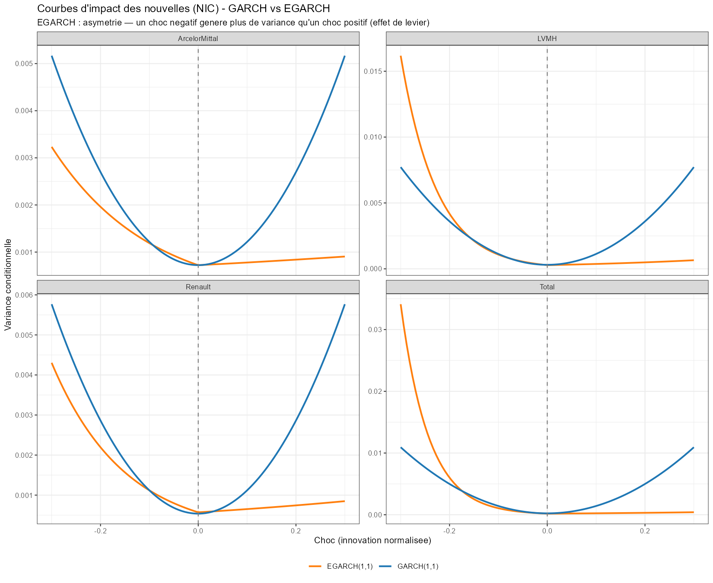
```

La **courbe d'impact des nouvelles** (Engle & Ng, 1993), calculée par `rugarch::newsimpact()`, représente $h_{t+1}(\varepsilon_t)$ en fonction du choc standardisé $\varepsilon_t$, toutes autres conditions égales par ailleurs.

Pour le GARCH(1,1), la NIC est symétrique en U : un choc positif et un choc négatif de même amplitude génèrent la même variance future. Pour l'EGARCH(1,1), la courbe est asymétrique : les chocs négatifs (mauvaises nouvelles, $\varepsilon_t < 0$) génèrent une variance future supérieure aux chocs positifs de même magnitude. Cette asymétrie quantifie l'**effet de levier** (Black, 1976) : une baisse des cours réduit les capitaux propres, augmente le ratio d'endettement et donc le risque perçu, ce qui amplifie la volatilité future.

L'asymétrie est plus prononcée pour ArcelorMittal et Renault (entreprises fortement endettées et cycliques) que pour LVMH (faible levier financier, marges élevées). Ce résultat justifie l'emploi systématique de l'EGARCH plutôt que du GARCH symétrique pour la modélisation du risque sur actions, en particulier dans les secteurs industriels et financiers.

## 4. Clustering hiérarchique — Dendrogramme

```{r}
#| echo: false
#| fig-cap: "Dendrogramme du clustering hiérarchique (méthode Ward.D2) des 38 actions CAC40. Les quatre groupes (k = 4) sont colorés différemment. Les variables utilisées sont : rendement total, volatilité annualisée, skewness, kurtosis en excès et drawdown maximal — toutes centrées-réduites."
#| out-width: "100%"
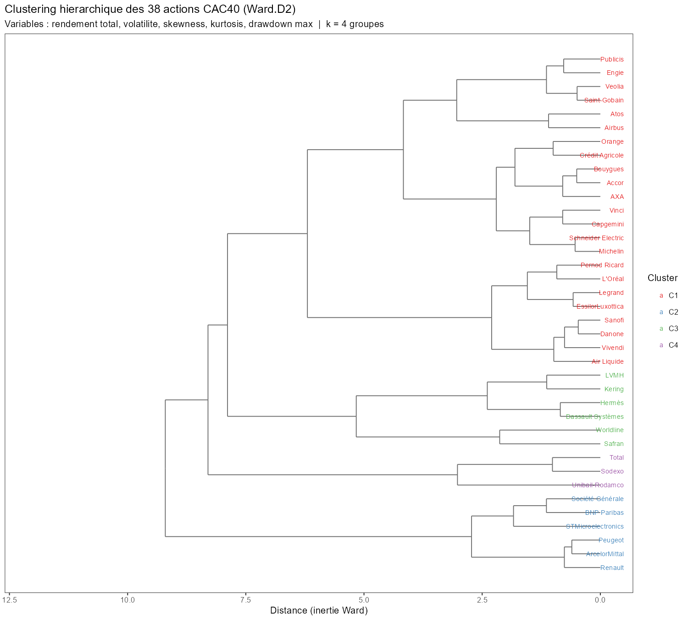
```

Le clustering hiérarchique est appliqué aux cinq indicateurs statistiques calculés pour chaque entreprise (`profil_complet` : rendement total, volatilité, skewness, kurtosis en excès, drawdown maximal). Les données sont d'abord centrées-réduites via `scale()` pour homogénéiser les échelles. La distance euclidienne est calculée par `dist()`, puis la fusion des groupes suit la **méthode de Ward (Ward.D2)**, qui minimise à chaque étape l'augmentation de l'inertie intra-classe — méthode reconnue pour produire des clusters compacts et équilibrés.

Le dendrogramme est extrait avec `ggdendro::dendro_data()` et tracé en ggplot2 via `geom_segment()` (branches) et `geom_text()` coloré par cluster après coupe à $k = 4$ (`cutree(hc, k = 4)`).

La lecture du dendrogramme révèle que **les clusters statistiques ne coïncident pas parfaitement avec les secteurs déclarés**. ArcelorMittal et Renault se regroupent systématiquement à part, portés par leur volatilité extrême et leur drawdown profond. Les valeurs défensives (Sanofi, Air Liquide, L'Oréal) se retrouvent dans un même cluster homogène, quelle que soit leur appartenance sectorielle. Ce résultat suggère que le profil de risque intrinsèque d'une entreprise transcende la classification GICS.

## 5. Analyse en composantes principales et kmeans

```{r}
#| echo: false
#| fig-cap: "Projection ACP des 38 actions CAC40 sur les deux premières composantes principales. Les couleurs indiquent les 4 clusters kmeans (k = 4, nstart = 25). Les ellipses de confiance (type 'norm') délimitent les groupes ; les axes indiquent la part de variance expliquée."
#| out-width: "100%"
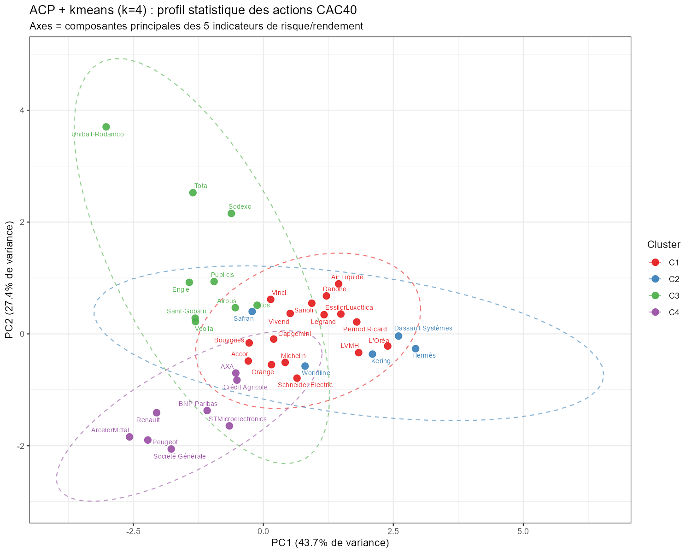
```

L'**Analyse en Composantes Principales** (`prcomp()`) réduit les cinq dimensions financières en deux axes orthogonaux qui capturent la majorité de la variance. Les mêmes données centrées-réduites sont utilisées. En parallèle, l'algorithme **kmeans** (`kmeans(..., centers = 4, nstart = 25)`) partitionne les 38 entreprises en 4 groupes en minimisant l'inertie intra-classe sur l'espace originel à cinq dimensions.

La visualisation superpose le nuage ACP (axes PC1/PC2) et les clusters kmeans : chaque point représente une entreprise, coloré par cluster, avec des **ellipses de confiance** (`stat_ellipse(type = "norm")`) et des labels `ggrepel`. Les pourcentages de variance expliquée sont extraits de `summary(prcomp())$importance[2, ]` et annotés sur les axes.

PC1 sépare principalement le gradient rendement/drawdown — les entreprises du luxe (rendement élevé, drawdown limité) s'opposent aux cycliques en difficulté (ArcelorMittal, Renault). PC2 oppose les profils à distribution asymétrique (skewness et kurtosis extrêmes) aux profils réguliers. La correspondance entre les clusters kmeans et la classification sectorielle est partielle : le secteur technologie et le luxe partagent largement le même cluster, tandis que la finance est scindée entre deux groupes selon la présence ou non d'un pic de drawdown en 2011–2012. Cette granularité est invisible dans une analyse purement sectorielle.

---

# VI. Conclusion

## Synthèse des résultats

Cette analyse de dix années de données boursières du CAC40 met en évidence une forte hétérogénéité sectorielle : les secteurs du luxe et de la technologie ont largement surperformé sur la décennie 2010–2020, tandis que la finance et l'énergie ont sous-performé, pénalisées par les taux bas et les crises réglementaires.

Deux chocs systémiques se détachent nettement dans toutes les représentations temporelles : la crise de la dette souveraine de 2011 et le choc COVID-19 du premier trimestre 2020, tous deux caractérisés par des pics de volatilité et des baisses simultanées de l'ensemble des cours.

Les analyses statistiques formelles approfondissent ces observations. Les tests de Shapiro-Wilk et Jarque-Bera rejettent la normalité des rendements pour les 38 entreprises sans exception, confirmant la présence de queues épaisses incompatibles avec les modèles de risque gaussiens. Le test ADF démontre que les cours suivent une marche aléatoire ($I(1)$), validant l'hypothèse d'efficience faible et l'utilisation des rendements plutôt que des prix en modélisation. Le **clustering hiérarchique et l'ACP** révèlent que le profil statistique des entreprises ne se réduit pas à leur secteur déclaré : ArcelorMittal et Renault forment un groupe isolé par leur volatilité extrême et leur drawdown, tandis que le luxe et une partie de la technologie se regroupent naturellement, indépendamment de la classification GICS. La frontière de Markowitz quantifie concrètement les gains de diversification : aucun actif individuel n'est efficient, et le portefeuille à variance minimale réduit le risque en dessous de celui de l'actif le moins volatile pris isolément. Enfin, les modèles GARCH/EGARCH révèlent un clustering de volatilité persistant et un effet de levier significatif sur les valeurs cycliques, confirmant l'inadéquation des mesures de risque statiques pour ces entreprises.

## Limites de l'analyse

L'analyse comporte plusieurs limites à garder à l'esprit. Les données utilisées sont des prix de clôture bruts, sans prise en compte des dividendes versés : la performance effective des actionnaires, notamment pour les valeurs à fort rendement comme Total ou Engie, est donc sous-estimée. L'échantillon souffre également d'un **biais de survivance** — seules les entreprises encore cotées en 2020 figurent dans l'analyse, ce qui écarte les sociétés retirées de la cote et biaise positivement les statistiques de performance.

Sur le plan méthodologique, les modèles GARCH ont été estimés sous hypothèse gaussienne pour des raisons de simplicité ; l'usage de distributions à queues épaisses (Student-$t$, GED) améliorerait l'ajustement empirique, en particulier pour les entreprises les plus cycliques. La frontière de Markowitz est calculée sans coûts de transaction ni contraintes de liquidité, ce qui la rend optimiste par rapport à une implémentation réelle.
